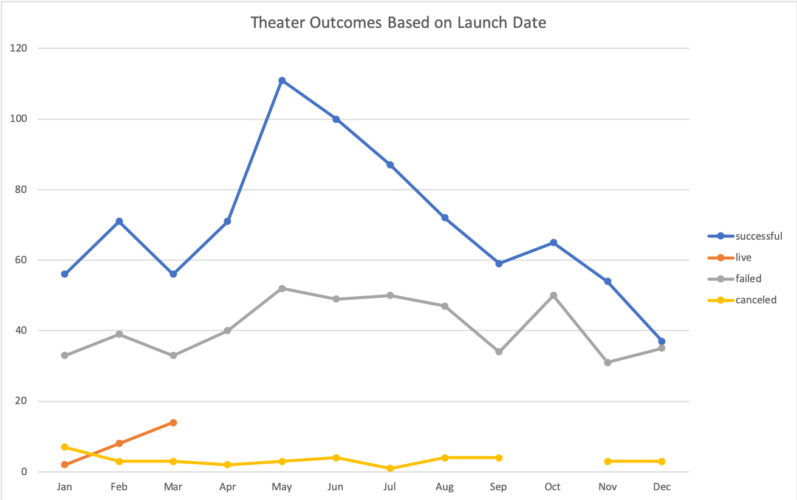

# Kickstarting with Excel

## Overview of Project
This is a project comparing different Kickstarter data as requested by Louise.
---

### Purpose
The Purpose of this project was to compare Kickstarter outcomes based on their goals and the dates they were launched. 
--- 
## Analysis and Challenges

I performed the analysis by creating two charts.

### Analysis of Outcomes Based on Launch Date
One chart shows a line graph that pinpoints launch date by month so that we can make a conclusion on which months were most successful for theater specifically.

### Analysis of Outcomes Based on Goals

 The other chart shows a line graph comparing the percentage of failed and successful campaigns based on their funding goal. 

 
 ---
### Challenges and Difficulties Encountered

Most challenges I encounted involved formating. Its definetly a learning curve figuring out what excel is picky about. I had trouble displaying one of my charts correctly at first. One of my rows got bumped to the bottom in the pivot table. Even though it belonged at the top Im assuming this happened bevause it wasnt just numbers. I learned that when you right click on a cell, you have the option to move it up as well as send it straight to the top.

I also learned its best to copy formatting to new sheets when copy and pasting information. Otherwise it can make things look weird.
---
## Results

Based on the outcomes by launch date chart may is the best month to launch a campaign and decemeber might be the worst.

Using the outcomes based on goals chart, we can say the percentage of successful campaigns meeting their goals were highest when asking for less than $5000. 

Another useful chart comparison could be comparing successful and failed theater campaigns based on subcategories. 